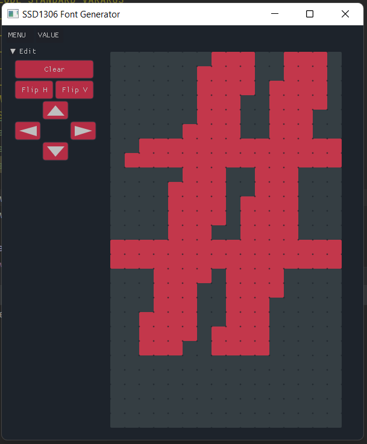

## GLCD Font Calculator

#### Description



This code is a simple SSD1306 font pixel calculator. I made this to use for my project <a href="https://github.com/the-this-pointer/timer-board-stm32f103" target="_blank">here</a>.

 You can use it for the following library also:

<a href="https://github.com/4ilo/ssd1306-stm32HAL" target="_blank">ssd1306-stm32HAL</a>

It is under HEAVY development for now, 
but you can use it for creating/editing characters. 

#### Build Instruction

The project doesn't need any dependencies, and uses `nuklear` for the GUI which is included in the project. At this time, just `Microsoft Windows` is supported.
You can build the project on windows using the following commands:

``` bash
mkdir build
cd build
cmake .. -G "MinGW Makefiles"
mingw32-make
```
* You should have `cmake` and `mingw` installation dir in your `PATH` environment variable.


#### Usage

**Remember! At this time you can edit or create a new character, but you can't import any character from any font file! Importing from font file is planned for future** 

Keep in mind that if you plan to work on a font with different dimensions, you can change the dimension from `Settings` menu (Located in `MENU`).

You have some fonts in the `fonts.c` file of the library, that every character presented in a line there, like this:

``` c
0x0800, 0x1800, 0x2800, 0x2800, 0x4800, 0x7C00, 0x0800, 0x0800, 0x0000, 0x0000,
```

###### Editing a character
Just copy the line and press the `Read f. Clipboard` menu (Located in `VALUE` menu) in the generator, this will parse the character and show that to you.

###### Generating a character

After editing pixels when you are ready to use the character, you should press the `Calc & Copy`, this will show you the generated data and also copy the data to the clipboard ready to use in the library. The generated data is like below:

``` c
0x0800, 0x1800, 0x2800, 0x2800, 0x4800, 0x7C00, 0x0800, 0x0800, 0x0000, 0x0000,
```
This calculator just create the character for you and the rest of code such as declaring font is on yourself.


#### Remaining Works

It doesn't support font generation based on true-type fonts yet. 

These are the remaining tasks I plan to do in my spare time:

- Edit multiple characters simultaneously
- Create chars from true-type fonts